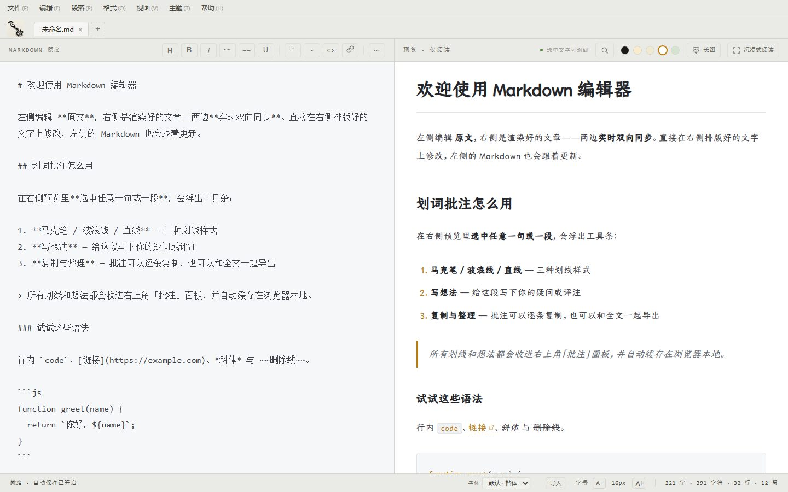
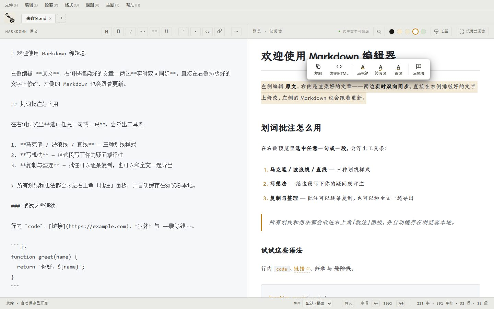
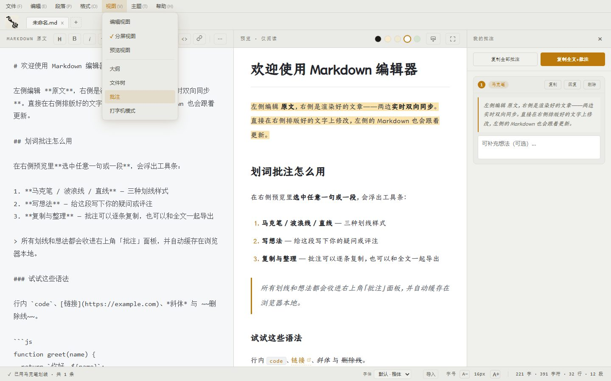
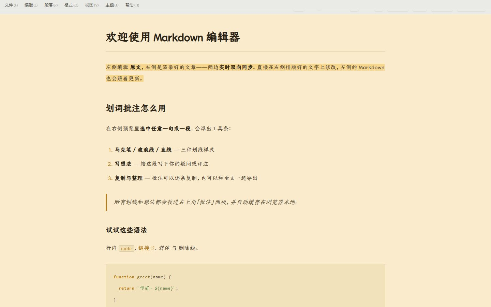
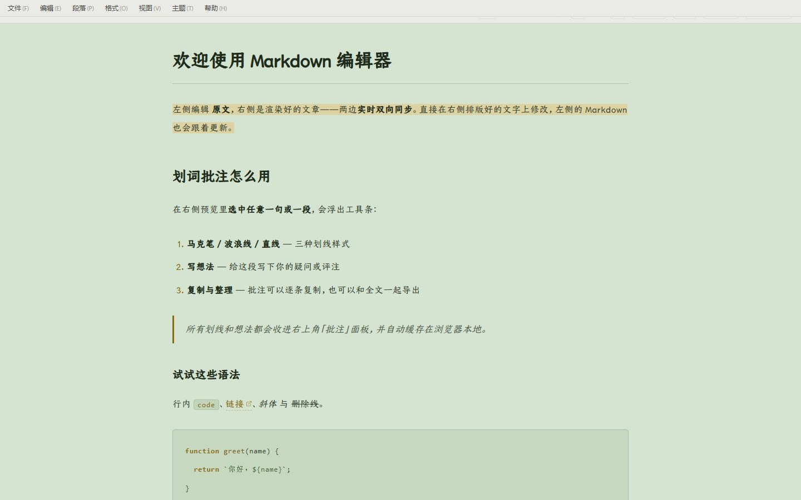

# 飞白（Inkwhite）

一个源码开放、面向阅读、学习和评注的 Markdown 桌面编辑器：多文档标签页、直接编辑、实时预览、双向定位、划线批注、搜索替换、保存长图、导出 HTML/PDF/Word、本地文件双向同步。基于 Tauri 2 构建（Windows / macOS），原生文件对话框与真实路径，双击 `.md` 直接打开。

界面采用墨笺（Mojian）设计系统的「墨」暗色主题：暖棕墨色 + 单一琥珀强调色 + 楷体阅读衬线；左上角以「飞白」狂草书法印章作为品牌。



左侧保留 Markdown 原文（顶部带常用格式快捷按钮），右侧呈现只读的阅读预览；最近阅读、当前目录文件与文章大纲围绕侧边栏组织。所有字体（阅读字体 + 源码字体同步 + 字号）集中在状态栏右下角控制。

## 核心能力

### 多文档标签页

顶部标签栏统一管理多个文档：`Ctrl+T` 新建、`Ctrl+W` 关闭、`Ctrl+Tab` 切换；未保存改动有脏标记与关闭确认；重启后自动恢复全部标签与内容。

### 直接编辑，实时生效

编辑 Markdown 后右侧预览实时更新；预览仅阅读，不做直接编辑。源码区提供常用格式快捷按钮（标题 / 加粗 / 斜体 / 删除线 / 高亮 / 下划线 / 引用 / 列表 / 行内代码 / 链接），以及「更多格式 ⋯」下拉（图片 / 表格 / 任务 / 代码块 / 分割线 / 上标 / 下标 / 脚注）。

### 上下文感知右键菜单

源码区（编辑 / 段落 / 格式 / 插入）、预览区（链接 / 图片 / 表格 / 选区）、侧边栏（目录浏览）、标签页（新建 / 关闭 / 关闭其他 / 关闭右侧）各有相应的右键菜单，视口内自动翻转定位。

### 统一字体（源码 + 预览同步）

右下角状态栏选择字体后，源码编辑区、预览正文与搜索高亮层同时切换；「等宽」选项可切回源码对齐排版。字号 `A− / A+` 同步作用于两侧。支持导入 ttf/otf/woff/woff2 字体并持久化。

### 双向定位

在 Markdown 原文双击定位到预览对应位置；在预览双击定位回原文。

### 划线批注

在预览中选中文字，可添加马克笔、波浪线、直线或想法批注，集中展示在「我的批注」面板。批注随当前文章保存在本地 `localStorage`。





### 搜索与替换

`Ctrl+F` 搜索原文/预览（按视图自动路由），`Ctrl+H` 展开替换并支持全部替换；区分大小写、全字匹配、正则选项，搜索高亮与原文镜像层同步。

### 沉浸式阅读与纸张主题

进入沉浸式阅读后，可以隐藏编辑区域与侧边列表，只保留文章内容；支持标准 / 宽屏阅读、字号调整，以及墨黑、羊皮纸、米黄、清爽白、豆沙绿五种纸张主题。

| 羊皮纸 | 豆沙绿 |
| --- | --- |
|  |  |

### 保存长图

预览工具栏的「长图」把当前预览渲染成一张可分享的 PNG：排版、阅读字体、纸色和划线批注都与预览一致，首个一级标题升格为海报标题，页脚带上文件名与日期。可选手机 / 标准两档宽度，也可以关掉划线只导出干净正文。长图里没有滚动条，表格与代码块会自动折行而不是被裁掉；超长文章按画布上限自动降倍率并分片渲染后拼接。

### 导出与本地文件同步

- 通过「文件」菜单可导出 **HTML / PDF（打印）/ Word（.docx）**，也可快速打开、最近文档、插入图片。
- 打开本地 `.md` 后：编辑内容自动写回（autosave）；外部程序修改后自动重载；双方同时改动时进入冲突状态，等 `Ctrl+S` 显式覆盖；路径显示在状态栏。

## 桌面端

飞白是纯桌面应用（Windows / macOS），由 Tauri 2 提供系统集成：

- **原生文件对话框与真实绝对路径**——授权一次持久生效（`granted-paths.json`），重启后本地文件双向同步与所在目录浏览自动恢复；
- **系统集成**——在资源管理器中双击 `.md` / 「打开方式」直接进入编辑器（打包版含文件关联）；打开即授权该文档所在目录；
- **原生文件监听**——外部程序修改文档后自动重载；若编辑器还有未保存改动则进入冲突状态，等你 `Ctrl+S` 显式覆盖；
- **侧边栏目录浏览**——「文件」页签显示当前文档所在文件夹内的 Markdown 文件，点击在新标签页打开；「大纲」页签按标题跳转。

## 快速开始

```bash
npm install
npm run tauri:dev    # 启动桌面应用（前端 + Rust 后端）
```

只调试前端界面时，也可以单独起 Vite：

```bash
npm run dev          # http://127.0.0.1:1420
```

## 打包

```bash
npm run tauri:build  # 产出安装包（输出到 src-tauri/target/release/bundle/）
```

安装包保持轻量（NSIS ~8MB 级）：体积守护的目标是"尽量小"而非硬性红线，内置楷体字体作为阅读护城河保留不剔除。

## 阅读字体（可选）

界面的楷体阅读字体是仓耳今楷 04。**字体不随仓库分发**（版权归字体所有者），不获取字体时会自动回退到系统楷体（Kaiti SC / 楷体），功能不受影响。

想要完整视觉效果，运行：

```bash
npm run font:fetch
```

脚本会从微信读书官方 CDN 下载字体、做 SHA-256 校验，并自动裁剪出 GB2312 字符集的 woff2 子集（约 2MB，原字体 16MB）放入 `public/fonts/`。生僻字由系统楷体逐字兜底。字体来源与校验信息见 `fonts-src/canger-jinkai-04/SOURCE.md`；使用请遵守字体所有者的许可条款。

顶部品牌「飞白」为狂草书法印章（`images/feibai_kuangcao_jianfei_s.jpg`，随包分发在 `public/images/`）。

## 开发

```bash
npm run check       # 代码体积守护（尽量小）+ 类型检查 + 单元测试 + Rust 测试 + 构建
npm test            # 前端单元测试（node:test，秒级）
npm run test:rust   # Rust 单元测试（cargo；Windows 下需 gnu 工具链环境）
npm run test:e2e    # 端到端测试（Playwright，首次先 npx playwright install chromium）
npm run check:full  # check + 端到端
```

代码规范见 `docs/CODING_GUIDELINES.md`，测试体系与 test-first 工作流见 `docs/TESTING.md`；使用编码 Agent 协作时请先读 `AGENTS.md`。

## 版权与许可

软件代码采用 [MIT License](./LICENSE)（Copyright © 2026 jishuai），可自由使用、修改、分发（含商用），须保留版权声明与许可文本。分支/历史版本如采用其他许可，以对应文件与 LICENSING 说明为准。

完整的授权范围说明见 [LICENSING.md](./LICENSING.md)。仓耳今楷字体不属于本仓库授权范围，其使用与再分发受字体所有者的许可条款约束。
